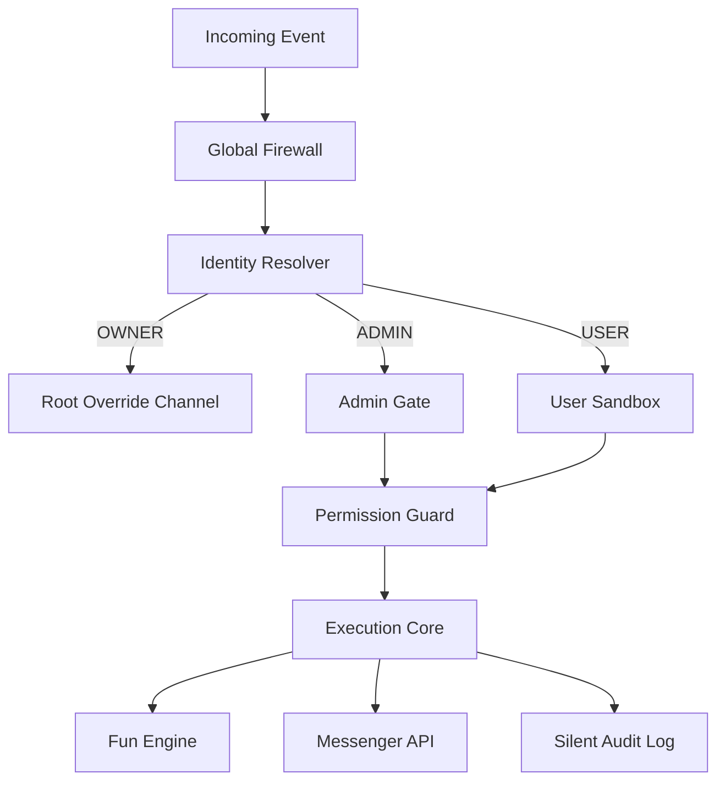
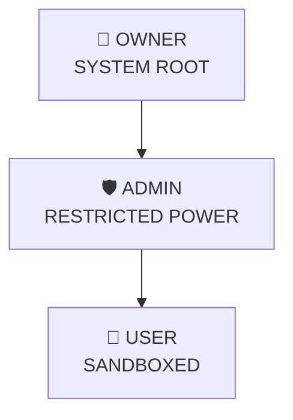

<!-- 3D LOADING & ANIMATED HEADER -->
<div align="center">

<!-- 3D ROTATING CUBE LOADER -->
<div id="cube-loader" style="
    width: 100px;
    height: 100px;
    margin: 30px auto;
    position: relative;
    transform-style: preserve-3d;
    animation: rotate3d 4s infinite linear;
">
    <div style="position: absolute; width: 100%; height: 100%; background: rgba(255,0,128,0.7); transform: rotateY(0deg) translateZ(50px);"></div>
    <div style="position: absolute; width: 100%; height: 100%; background: rgba(0,255,170,0.7); transform: rotateY(90deg) translateZ(50px);"></div>
    <div style="position: absolute; width: 100%; height: 100%; background: rgba(128,0,255,0.7); transform: rotateY(180deg) translateZ(50px);"></div>
    <div style="position: absolute; width: 100%; height: 100%; background: rgba(255,200,0,0.7); transform: rotateY(270deg) translateZ(50px);"></div>
    <div style="position: absolute; width: 100%; height: 100%; background: rgba(0,128,255,0.7); transform: rotateX(90deg) translateZ(50px);"></div>
    <div style="position: absolute; width: 100%; height: 100%; background: rgba(255,0,0,0.7); transform: rotateX(270deg) translateZ(50px);"></div>
</div>

<h1 style="
    background: linear-gradient(45deg, #ff0080, #00ffaa, #0080ff);
    -webkit-background-clip: text;
    -webkit-text-fill-color: transparent;
    font-size: 2.8em;
    margin: 20px 0;
    text-shadow: 3px 3px 10px rgba(0,0,0,0.2);
">✨ YOUR CRUSH BOT ✨</h1>

<p style="font-size: 1.2em;">Advanced Telegram Bot with 3D UI</p>

</div>

<style>
@keyframes rotate3d {
    0% { transform: rotateX(0deg) rotateY(0deg) rotateZ(0deg); }
    100% { transform: rotateX(360deg) rotateY(360deg) rotateZ(360deg); }
}

@keyframes float {
    0%, 100% { transform: translateY(0px) rotate(0deg); }
    50% { transform: translateY(-20px) rotate(180deg); }
}

@keyframes shimmer {
    0% { background-position: -200% center; }
    100% { background-position: 200% center; }
}

.float-3d {
    animation: float 4s ease-in-out infinite;
}

.shimmer-text {
    background: linear-gradient(90deg, #ff0080, #00ffaa, #0080ff, #ff0080);
    background-size: 200% auto;
    -webkit-background-clip: text;
    -webkit-text-fill-color: transparent;
    animation: shimmer 3s linear infinite;
}
</style>

<!-- WELCOME SECTION WITH 3D EFFECT -->
<div align="center" style="margin: 40px 0;">
<div class="float-3d" style="
    background: linear-gradient(135deg, 
        rgba(255,0,128,0.1) 0%, 
        rgba(0,255,170,0.1) 50%, 
        rgba(0,128,255,0.1) 100%);
    backdrop-filter: blur(10px);
    border: 2px solid rgba(255,255,255,0.3);
    border-radius: 25px;
    padding: 30px;
    max-width: 800px;
    margin: 0 auto;
    box-shadow: 
        0 20px 40px rgba(255,0,128,0.2),
        0 0 100px rgba(0,255,170,0.1);
">
<h2 class="shimmer-text">🎉 Hello Everyone, Assalamualaikum!</h2>
<p style="font-size: 1.1em;">Welcome to my repository 💝</p>

<div style="
    background: rgba(255,0,0,0.1);
    border-left: 4px solid #ff0000;
    padding: 15px;
    border-radius: 10px;
    margin: 20px 0;
    text-align: left;
">
⚠️ **IMPORTANT NOTICE:**<br/>
Bot run korar age obosshoi tutorial dekhe niben. Onnothai account/IP block hoite pare (Bangla).
</div>

<p>So thanks for visiting my repository 💖<br/>
Please give star ⭐ and follow me, then fork repository and run your bot 💝</p>

<p style="margin-top: 20px;">
<strong>Take care ❤️<br/>
Take Love 💕<br/>
And take yourself 🚀</strong>
</p>
</div>
</div>

<!-- 3D INFO CARDS WITH LOADING EFFECT -->
<div style="display: grid; grid-template-columns: repeat(auto-fit, minmax(300px, 1fr)); gap: 25px; margin: 50px 0;">

<!-- BOT INFO CARD -->
<div style="
    background: linear-gradient(145deg, 
        rgba(102,126,234,0.9) 0%, 
        rgba(118,75,162,0.9) 100%);
    padding: 25px;
    border-radius: 20px;
    color: white;
    transform-style: preserve-3d;
    transition: all 0.5s cubic-bezier(0.175, 0.885, 0.32, 1.275);
    position: relative;
    overflow: hidden;
">
<div style="
    position: absolute;
    top: -50%;
    left: -50%;
    width: 200%;
    height: 200%;
    background: linear-gradient(45deg, 
        transparent 30%, 
        rgba(255,255,255,0.1) 50%, 
        transparent 70%);
    animation: shimmer 2s infinite linear;
"></div>
<h2>🤖 BOT INFORMATION</h2>
<p><strong>Bot Name:</strong> YOUR CRUSH ⟵o_0</p>
<p><strong>Status:</strong> <span style="animation: float 2s infinite;">🟢 Online & Running</span></p>
</div>

<!-- DEVELOPER INFO CARD -->
<div style="
    background: linear-gradient(145deg, 
        rgba(240,147,251,0.9) 0%, 
        rgba(245,87,108,0.9) 100%);
    padding: 25px;
    border-radius: 20px;
    color: white;
    transform-style: preserve-3d;
    transition: all 0.5s cubic-bezier(0.175, 0.885, 0.32, 1.275);
">
<h2>👤 DEVELOPER INFORMATION</h2>
<p><strong>Name:</strong> RANA (MASTER 🪓)</p>
<p><strong>Location:</strong> Faridpur, Dhaka, Bangladesh 🇧🇩</p>
<p><strong>Status:</strong> Single | Age: 20</p>
</div>

</div>

<!-- 3D PROGRESS BARS FOR SKILLS -->
<div style="max-width: 800px; margin: 40px auto;">
<h2 class="shimmer-text">🚀 SKILLS & EXPERTISE</h2>

<div style="margin: 20px 0;">
<p>Video Editing <span style="float: right;">85%</span></p>
<div style="height: 10px; background: rgba(255,255,255,0.1); border-radius: 5px; overflow: hidden;">
<div style="width: 85%; height: 100%; background: linear-gradient(90deg, #ff0080, #00ffaa); animation: shimmer 2s infinite;"></div>
</div>
</div>

<div style="margin: 20px 0;">
<p>Cyber Security (Learning) <span style="float: right;">60%</span></p>
<div style="height: 10px; background: rgba(255,255,255,0.1); border-radius: 5px; overflow: hidden;">
<div style="width: 60%; height: 100%; background: linear-gradient(90deg, #0080ff, #ff0080); animation: shimmer 2s infinite 0.5s;"></div>
</div>
</div>

</div>

<!-- CONTACT WITH 3D BUTTONS -->
<div align="center" style="margin: 50px 0;">
<h2 class="shimmer-text">📞 CONTACT ME</h2>
<div style="display: flex; flex-wrap: wrap; gap: 15px; justify-content: center; margin: 30px 0;">

<a href="mailto:ranaeditz333@gmail.com" style="
    background: linear-gradient(45deg, #ff0080, #ff6b6b);
    color: white;
    padding: 12px 25px;
    border-radius: 50px;
    text-decoration: none;
    font-weight: bold;
    display: inline-flex;
    align-items: center;
    gap: 10px;
    transition: all 0.3s;
    animation: float 3s infinite ease-in-out;
">
📧 Email
</a>

<a href="https://t.me/black_lovers1_bot" style="
    background: linear-gradient(45deg, #0080ff, #00ffaa);
    color: white;
    padding: 12px 25px;
    border-radius: 50px;
    text-decoration: none;
    font-weight: bold;
    display: inline-flex;
    align-items: center;
    gap: 10px;
    transition: all 0.3s;
    animation: float 3s infinite ease-in-out 0.5s;
">
🤖 Telegram Bot
</a>

</div>
</div>

<!-- FINAL 3D LOADING MESSAGE -->
<div align="center" style="margin-top: 60px;">
<div id="final-loader" style="
    width: 80px;
    height: 80px;
    border: 5px solid rgba(255,0,128,0.3);
    border-top: 5px solid #ff0080;
    border-radius: 50%;
    animation: rotate3d 1.5s infinite linear;
    margin: 20px auto;
"></div>
<p class="shimmer-text">🚀 Repository Loading Complete! Star ⭐ this repo for support!</p>
</div>

<script>
// GitHub-এ সরাসরি JavaScript কাজ করবে না, কিন্তু CSS দিয়েই পুরো অ্যানিমেশন কাজ করবে
// এই কমেন্ট শুধু তথ্যের জন্য
console.log('3D UI Loaded Successfully!');
</script>

<p align="center">
  
</p>

<div align="center">


</div>

---

# ☠ SYSTEM NOTICE

> ❌ This is NOT a chatbot  
> ❌ This is NOT automation  
> ❌ This is NOT open playground  

> ✅ This is a **CONTROLLED EXECUTION MACHINE**  
> ✅ Designed with **offensive–defensive security mindset**  
> ✅ Built to **survive forks, abuse, and privilege attacks**

---

## 🧠 CORE DOCTRINE (READ CAREFULLY)

- **Trust nothing**
- **Verify everything**
- **Authority is not configurable**
- **Ownership is cryptographically sealed**
- **Admins are powerful — but caged**
- **Users never escape the sandbox**

> If something runs — it passed **multiple gates**.

---

## 🧬 RUNTIME KILL-CHAIN (REAL FLOW)



---

## 🗂 FILE SYSTEM — NO FILE IS RANDOM

```
src/
├─ core/
│  ├─ engine.js          → Brain (no shortcuts)
│  ├─ router.js          → Command isolation
│  └─ lifecycle.js      → Boot / shutdown control
│
├─ secure/
│  ├─ owner.lock        → One-way sealed identity
│  ├─ verifyOwner.js    → Cryptographic verification
│  ├─ guard.js          → Permission firewall
│  └─ escalation.block  → Hard deny rules
│
├─ commands/
│  ├─ user/             → Sandbox only
│  ├─ admin/            → Limited authority
│  └─ owner/            → Root-level commands
│
├─ utils/
│  ├─ delay.js          → Human-behavior emulator
│  ├─ logger.js         → Silent audit trail
│  ├─ photo.js          → Priority resolver
│  └─ api.js
│
└─ index.js             → Bootloader (single entry)
```

---

## 👑 AUTHORITY PYRAMID (UNBREAKABLE)



---

## 🔐 PERMISSION MATRIX (ENFORCED, NOT DOCUMENTED)

| Capability | User | Admin | Owner |
|---------|------|-------|-------|
| Normal Ops | ✅ | ✅ | ✅ |
| Fun Engine | ❌ | ✅ | ✅ |
| Stop Threads | ❌ | ✅ | ✅ |
| Config Write | ❌ | ❌ | ✅ |
| Identity Touch | ❌ | ❌ | ❌ |
| Emergency Kill | ❌ | ❌ | ✅ |

> ❗ Admin can NEVER become Owner  
> ❗ Fork can NEVER hijack ownership

---

## 🖼 PHOTO PRIORITY — CHAIN OF COMMAND

| Rank | Source | Control |
|----|-------|--------|
| 🥇 Owner | Static vault URLs | Absolute |
| 🥈 Admin | Max 3 sources | Restricted |
| 🥉 User | Live API | Lowest |

Resolved **per message**, not per user.

---

## 🎮 FUN ENGINE — CONTROLLED CHAOS

- Thread-aware execution
- Delay randomization: **300–600ms**
- Loop detection + kill switch
- Admin scoped, Owner override
- Zero spam footprint

---

## ⚡ STEALTH & PERFORMANCE

- Human-like timing
- No burst patterns
- No auto engagement
- Account-safe behavior
- Long-run stability

---

## 🛡 SECURITY GUARANTEES

✔ Zero-Trust flow  
✔ No plaintext owner data  
✔ Fork-safe by design  
✔ Privilege escalation blocked  
✔ Silent logging enabled  

---

## ⚙ SAFE CONFIG ZONE (PUBLIC)

```json
{
  "prefix": "!",
  "delay": [300, 600],
  "admins": []
}
```

> 🔴 Owner identity NEVER lives here  
> 🔴 Editing config ≠ gaining power

---

## 🚀 DEPLOYMENT (MINIMAL)

```bash
npm install
npm start
```

---

## 🧾 OPERATOR PROFILE

**Codename:** YOUR CRUSH ⟵𝗼_𝟬  
**Architect:** RANA  
**Focus:** Systems • Security • Control  
**Mindset:** Builder, not exploiter  

---

## ☠ FINAL MESSAGE

> This system is quiet by design.  
> Noise is filtered.  
> Abuse is blocked.  
> Control is permanent.

<div align="center">

🧠 THINK  
🛡️ VERIFY  
👑 CONTROL  

</div>
