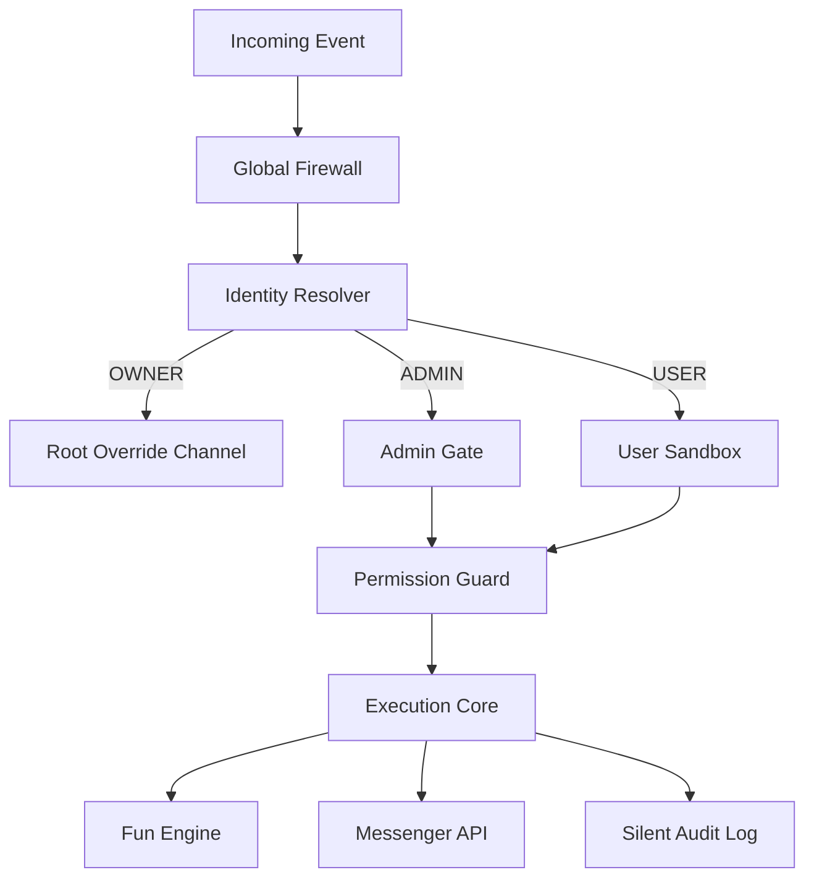
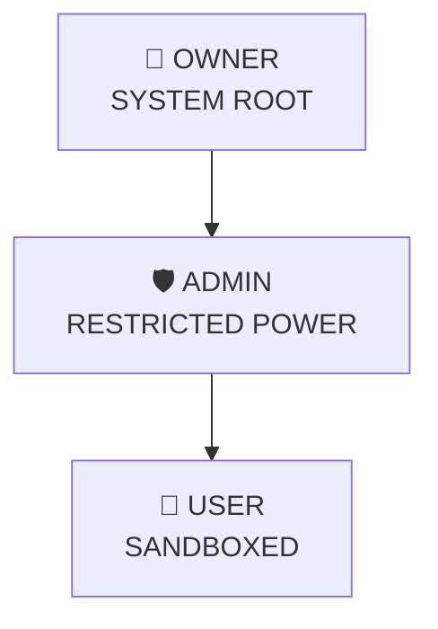

#### 𝗬𝗢𝗨𝗥 𝗖𝗥𝗨𝗦𝗛 ⟵𝗼_𝟬
<p align="center">
  
</p>


<div align="center">

[](https://yourusername.github.io/your-repo/)

[](https://raw.githack.com/yourusername/your-repo/main/3d_ui.html)


<!-- আপনার তৈরি GIF লিংক দিন -->


</div>

---

# ☠ SYSTEM NOTICE

> ❌ This is NOT a chatbot  
> ❌ This is NOT automation  
> ❌ This is NOT open playground  

> ✅ This is a **CONTROLLED EXECUTION MACHINE**  
> ✅ Designed with **offensive–defensive security mindset**  
> ✅ Built to **survive forks, abuse, and privilege attacks**

---

## 🧠 CORE DOCTRINE (READ CAREFULLY)

- **Trust nothing**
- **Verify everything**
- **Authority is not configurable**
- **Ownership is cryptographically sealed**
- **Admins are powerful — but caged**
- **Users never escape the sandbox**

> If something runs — it passed **multiple gates**.

---

## 🧬 RUNTIME KILL-CHAIN (REAL FLOW)



---

## 🗂 FILE SYSTEM — NO FILE IS RANDOM

```
src/
├─ core/
│  ├─ engine.js          → Brain (no shortcuts)
│  ├─ router.js          → Command isolation
│  └─ lifecycle.js      → Boot / shutdown control
│
├─ secure/
│  ├─ owner.lock        → One-way sealed identity
│  ├─ verifyOwner.js    → Cryptographic verification
│  ├─ guard.js          → Permission firewall
│  └─ escalation.block  → Hard deny rules
│
├─ commands/
│  ├─ user/             → Sandbox only
│  ├─ admin/            → Limited authority
│  └─ owner/            → Root-level commands
│
├─ utils/
│  ├─ delay.js          → Human-behavior emulator
│  ├─ logger.js         → Silent audit trail
│  ├─ photo.js          → Priority resolver
│  └─ api.js
│
└─ index.js             → Bootloader (single entry)
```

---

## 👑 AUTHORITY PYRAMID (UNBREAKABLE)



---

## 🔐 PERMISSION MATRIX (ENFORCED, NOT DOCUMENTED)

| Capability | User | Admin | Owner |
|---------|------|-------|-------|
| Normal Ops | ✅ | ✅ | ✅ |
| Fun Engine | ❌ | ✅ | ✅ |
| Stop Threads | ❌ | ✅ | ✅ |
| Config Write | ❌ | ❌ | ✅ |
| Identity Touch | ❌ | ❌ | ❌ |
| Emergency Kill | ❌ | ❌ | ✅ |

> ❗ Admin can NEVER become Owner  
> ❗ Fork can NEVER hijack ownership

---

## 🖼 PHOTO PRIORITY — CHAIN OF COMMAND

| Rank | Source | Control |
|----|-------|--------|
| 🥇 Owner | Static vault URLs | Absolute |
| 🥈 Admin | Max 3 sources | Restricted |
| 🥉 User | Live API | Lowest |

Resolved **per message**, not per user.

---

## 🎮 FUN ENGINE — CONTROLLED CHAOS

- Thread-aware execution
- Delay randomization: **300–600ms**
- Loop detection + kill switch
- Admin scoped, Owner override
- Zero spam footprint

---

## ⚡ STEALTH & PERFORMANCE

- Human-like timing
- No burst patterns
- No auto engagement
- Account-safe behavior
- Long-run stability

---

## 🛡 SECURITY GUARANTEES

✔ Zero-Trust flow  
✔ No plaintext owner data  
✔ Fork-safe by design  
✔ Privilege escalation blocked  
✔ Silent logging enabled  

---

## ⚙ SAFE CONFIG ZONE (PUBLIC)

```json
{
  "prefix": "!",
  "delay": [300, 600],
  "admins": []
}
```

> 🔴 Owner identity NEVER lives here  
> 🔴 Editing config ≠ gaining power

---

## 🚀 DEPLOYMENT (MINIMAL)

```bash
npm install
npm start
```

---

## 🧾 OPERATOR PROFILE

**Codename:** YOUR CRUSH ⟵𝗼_𝟬  
**Architect:** RANA  
**Focus:** Systems • Security • Control  
**Mindset:** Builder, not exploiter  

---

## ☠ FINAL MESSAGE

> This system is quiet by design.  
> Noise is filtered.  
> Abuse is blocked.  
> Control is permanent.

<div align="center">

🧠 THINK  
🛡️ VERIFY  
👑 CONTROL  

</div>
